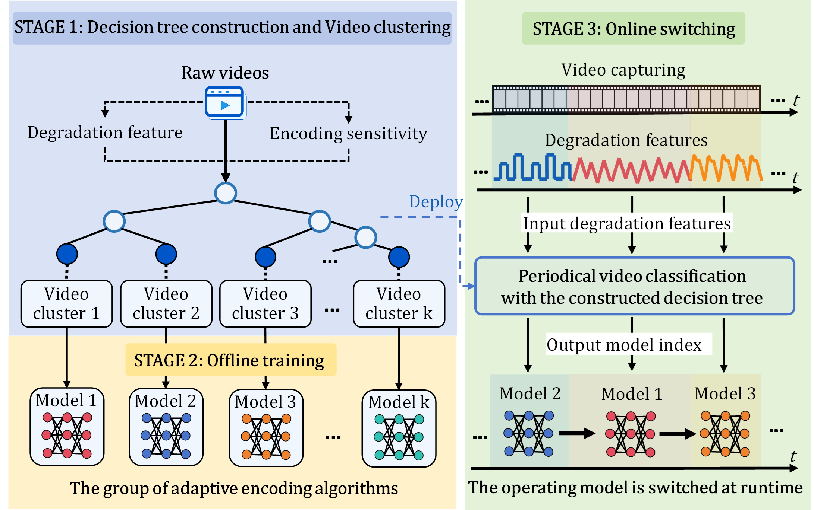

# DARE: Towards Video Analytics in Adverse Capture Environments: A Quality-Degradation-Aware Adaptive Encoding Framework


## Introduction

This repository contains the implementation of **DARE**, a quality-degradation-aware adaptive encoding framework for real-time video analytics under bandwidth constraints.

DARE exploits the encoding parameter sensitivity under different degradation conditions. It first calculates the encoding parameter sensitivity for each video session, then constructs a decision tree to identify the dominant encoding parameters, and finally trains encoding decision algorithms using imitation learning for adaptive configuration selection.

The framework consists of two stages:

- **Offline stage:**
  - Session-level encoding parameter sensitivity analysis.
  - Decision tree construction based on encoding parameter sensitivity.
  - Encoding decision model training using imitation learning.

- **Online stage:**
  - Degradation feature extraction from incoming videos.
  - Cluster index identification using the trained decision tree.
  - Encoding decision aglorithm selection for adaptive configuration prediction.


<p align="center">

</p>


---

# Code Structure


The repository is organized as follows:

```
DARE/

├── baselines/
│   ├── CASVA/
│   ├── DAO/
│   ├── FHVAC/
│   ├── ILCAS/
│   └── LCA/
│
└── DARE/
    │
    ├── decision_tree/
    │   ├── extract_deg_feature.py
    │   ├── sensitivity.py
    │   ├── tree_train.py
    │   └── apply_tree.py
    │
    ├── encoding_policy/
    │   ├── deg_feats/
    │   ├── utils/
    │   ├── DAgger_train.py
    │   ├── env.py
    │   ├── env_fix.py
    │   ├── Expert.py
    │   ├── network.py
    │   ├── replay_memory.py
    │   ├── test.py
    │   └── utils.py
    │
    └── online_switching.py
```


## Baselines

The `baselines/` directory contains the implementations of comparison methods.

- `CASVA/`: CASVA implementation.
- `DAO/`: DAO implementation.
- `FHVAC/`: FHVAC implementation.
- `ILCAS/`: ILCAS implementation.
- `LCA/`: LCA implementation.


## Decision Tree Construction

The `decision_tree/` directory implements session-level sensitivity analysis and decision tree construction for degradation pattern identification.

- `extract_deg_feature.py`: Extracts degradation-aware features from video sessions.
- `sensitivity.py`: Calculates the sensitivity of encoding parameters for each session.
- `tree_train.py`: Trains the decision tree based on degradation features and encoding parameter sensitivity.
- `apply_tree.py`: Applies the trained decision tree for cluster identification.


## Encoding Parameter Model Training

The `encoding_policy/` directory implements the training and inference of encoding decision aglorithms.

- `deg_feats/`: Stores degradation feature data used for model training.
- `utils/`: Contains utility functions for training and evaluation.
- `DAgger_train.py`: Trains the encoding decision aglorithm using DAgger-based imitation learning.
- `env.py`: Defines the training environment.
- `env_fix.py`: Provides auxiliary environment functions.
- `Expert.py`: Implements the expert policy for generating training labels.
- `network.py`: Defines the neural network architecture.
- `replay_memory.py`: Implements replay memory for model training.
- `test.py`: Evaluates the trained encoding decision aglorithm.
- `utils.py`: Provides general utility functions.


## Online Decision

`online_switching.py` implements the online adaptive encoding decision process, including degradation feature extraction, cluster identification, and encoding model selection.


---

# Environment Setup


## Requirements

- Python >= 3.8
- PyTorch >= 2.0
- CUDA >= 11.8


Install dependencies:

```bash
pip install -r requirements.txt
```


---

# Dataset Preparation

DARE is evaluated on four real-world video analytics datasets, including **UA-DETRAC, D²-City, DSEC, and LMOT**.

---

# Offline Training


The offline stage constructs degradation-aware encoding decision algorithms.


## 1. Encoding Sensitivity Analysis

DARE first evaluates different encoding configurations for each video session and calculates the sensitivity of encoding parameters.

Run:

```bash
python DARE/decision_tree/sensitivity.py
```

The generated encoding parameters sensitivity are used for decision tree construction.


## 2. Decision Tree Training

The decision tree learns the mapping between degradation features and encoding parameters sensitivity.

Run:

```bash
python DARE/decision_tree/tree_train.py
```


## 3. Encoding Decision Algorithm Training

Cluster-specific encoding decision algorithms are trained using imitation learning.

Run:

```bash
python DARE/encoding_policy/DAgger_train.py
```

To evaluate the trained encoding decision model, run:
```bash
python DARE/encoding_policy/test.py
```


---

# Online Inference


DARE performs adaptive encoding decisions for incoming video streams.

Run:

```bash
python DARE/online_switching.py
```
---


# Evaluation


DARE is evaluated using:

- F1-score for analytics accuracy.
- End-to-end latency for system efficiency.


Run evaluation:

```bash
python evaluation/test.py
```


---
